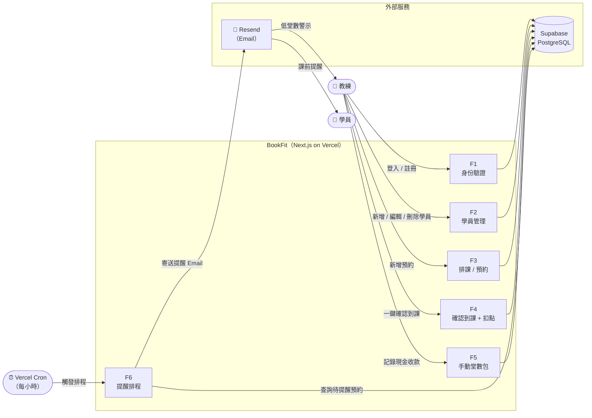
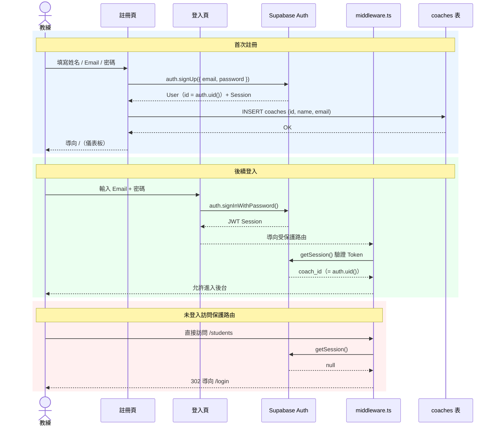
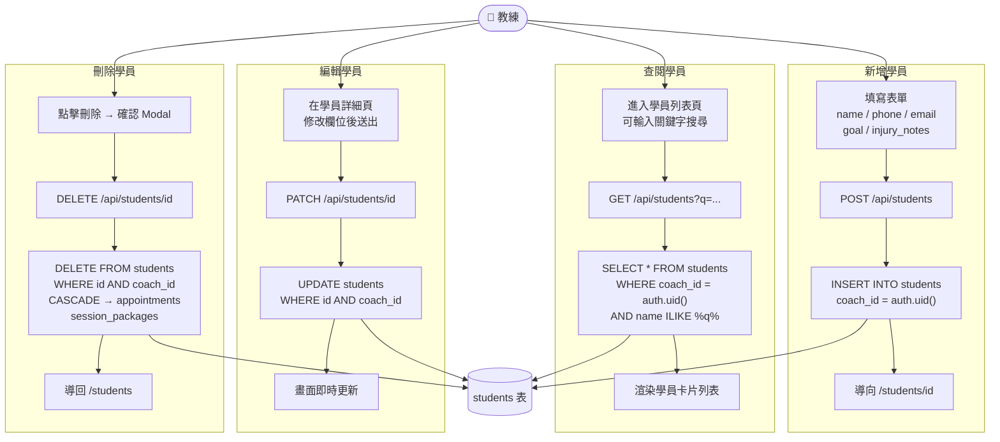
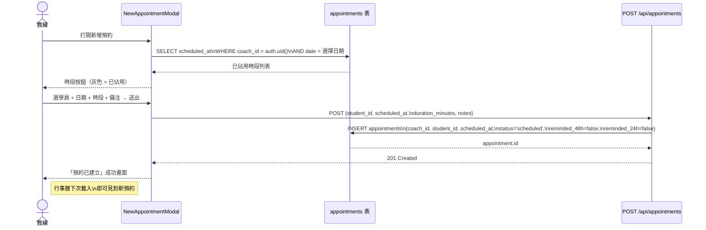
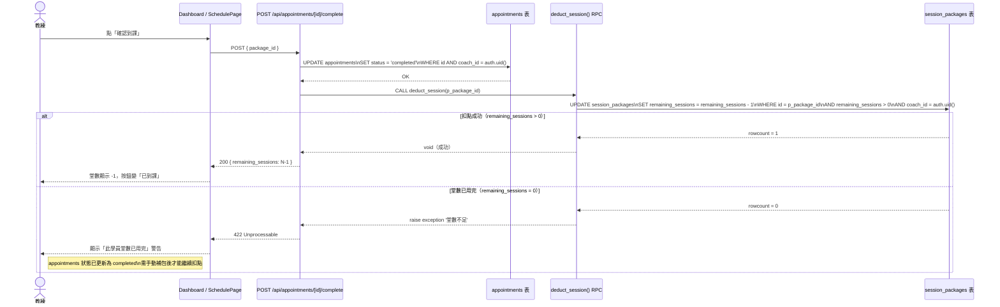
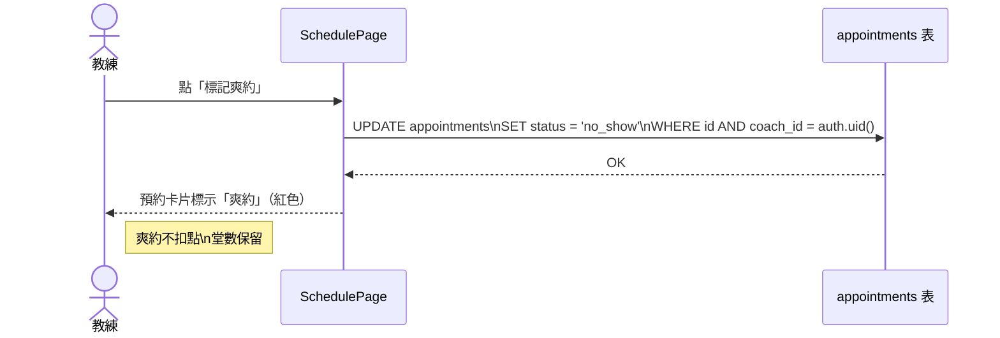
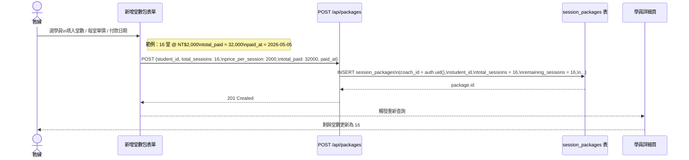
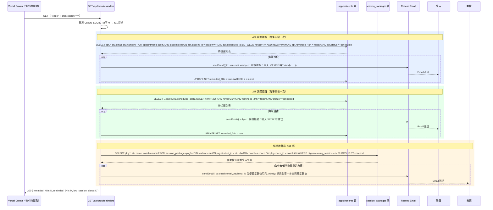

# 教練後台 SaaS — 完整開發計劃表

> 文件版本：v1.12 ／ 更新日期：2026-05-10  
> 目標：將目前原型升級為可商轉的完整 SaaS 平台

---

## 目錄

0. [核心資料流程圖（MVP V1）](#0-核心資料流程圖mvp-v1)
1. [現況盤點](#1-現況盤點)
2. [技術架構總覽](#2-技術架構總覽)
3. [目錄結構規劃](#3-目錄結構規劃)
4. [Phase 1 — V1 核心功能（Week 1–6）](#4-phase-1--v1-核心功能week-16)
5. [Phase 2 — V2 金流與進階功能（Week 7–11）](#5-phase-2--v2-金流與進階功能week-711)
6. [Phase 3 — V3 AI 差異化（Week 12–16）](#6-phase-3--v3-ai-差異化week-1216)
7. [API 端點規劃](#7-api-端點規劃)
8. [資料庫擴充項目](#8-資料庫擴充項目)
9. [基礎設施與 DevOps](#9-基礎設施與-devops)
10. [驗收標準](#10-驗收標準)

---

## 0. 核心資料流程圖（MVP V1）

> 涵蓋六條核心流程：身份驗證、學員管理、建立預約、確認到課與扣點、手動建立堂數包、自動提醒排程。  
> 圖表使用 [Mermaid](https://mermaid.js.org/) 語法，可在 GitHub / VS Code 直接渲染。

---

### 0.1 系統全覽（Context Diagram）

描述所有外部實體與系統模組之間的資料往來。



---

### 0.2 Flow 1 — 教練身份驗證（Auth）

**觸發：** 教練首次造訪或 Session 過期。  
**涉及資料表：** `coaches`、Supabase Auth



**資料流摘要**

| 方向 | 資料內容 |
|---|---|
| 教練 → Auth | `email`, `password`, `name` |
| Auth → coaches 表 | `id`（= auth.uid()）, `email`, `name` |
| Auth → Middleware | JWT Session（含 `coach_id`）|
| Middleware → 路由 | 允許 / 拒絕（302）|

---

### 0.3 Flow 2 — 學員管理（CRUD）

**觸發：** 教練在後台新增 / 查閱 / 修改 / 刪除學員。  
**涉及資料表：** `students`（RLS：`coach_id = auth.uid()`）



**RLS 保護：** 所有查詢均受 `coach_id = auth.uid()` 限制，教練無法存取他人學員。

---

### 0.4 Flow 3 — 建立預約

**觸發：** 教練點「新增預約」按鈕。  
**涉及資料表：** `appointments`、`students`



**輸入資料**

| 欄位 | 來源 |
|---|---|
| `coach_id` | auth.uid()（Server-side 注入，不信任 Client）|
| `student_id` | 教練從下拉選單選擇 |
| `scheduled_at` | 日期 + 時段組合 |
| `duration_minutes` | 預設 60，可調整 |
| `notes` | 選填 |

---

### 0.5 Flow 4 — 確認到課 + 課堂扣點

**觸發：** 教練點「確認到課」按鈕（Dashboard 今日課程 或 SchedulePage）。  
**涉及資料表：** `appointments`、`session_packages`  
**關鍵：** 兩個操作必須都成功，任一失敗應回滾（使用 Supabase RPC 原子操作）。



**爽約標記（簡化流程）**



---

### 0.6 Flow 5 — 手動建立堂數包（現金收款）

**觸發：** 教練收到現金後，手動在系統登記。  
**涉及資料表：** `session_packages`



**資料流摘要**

| 欄位 | 值 | 說明 |
|---|---|---|
| `total_sessions` | 16 | 購買堂數 |
| `remaining_sessions` | 16 | 初始等於 total（每次完課 -1）|
| `price_per_session` | 2000 | 每堂單價（台幣）|
| `total_paid` | 32000 | 實際收款金額 |
| `ecpay_trade_no` | null | 現金收款時為空；V2 綠界付款後自動填入 |

---

### 0.7 Flow 6 — Email 自動提醒排程（Cron）

**觸發：** Vercel Cron 每小時整點自動呼叫。  
**涉及資料表：** `appointments`、`session_packages`  
**通知服務：** Resend（V1 替代已 deprecate 的 LINE Notify）



**防重複發送保護**

| 欄位 | 用途 |
|---|---|
| `appointments.reminded_48h` | true 後不再觸發 48h 提醒 |
| `appointments.reminded_24h` | true 後不再觸發 24h 提醒 |
| 低堂數警示 | 每次 Cron 都會執行（教練每小時可能收到重複通知），V2 可加 `coach_notified_at` 欄位限頻 |

---

### 0.8 各流程涉及資料表對照

| 流程 | 讀取 | 寫入 / 更新 |
|---|---|---|
| F1 身份驗證 | Supabase Auth | `coaches`（INSERT）|
| F2 學員管理 | `students` | `students`（INSERT / UPDATE / DELETE）|
| F3 建立預約 | `appointments`（查已佔時段）| `appointments`（INSERT）|
| F4 確認到課 + 扣點 | — | `appointments`（UPDATE status）、`session_packages`（UPDATE remaining）|
| F4 爽約標記 | — | `appointments`（UPDATE status='no_show'）|
| F5 手動堂數包 | — | `session_packages`（INSERT）|
| F6 Email Cron | `appointments`、`session_packages`、`students`、`coaches` | `appointments`（UPDATE reminded_48h / 24h）|

---

## 1. 現況盤點

### 已完成（截至 2026-05-10）

| 類別 | 項目 | 狀態 |
|---|---|---|
| 資料庫 | `schema.sql` — 5 張資料表 + RLS + Stored Functions + Indexes | ✅ |
| 型別定義 | `types/index.ts` — 全部實體型別 | ✅ |
| 基礎連線 | `lib/supabase.ts` + `lib/supabase-server.ts` | ✅ |
| **身份驗證** | 登入頁 `app/login/page.tsx` | ✅ |
| **身份驗證** | 註冊頁 `app/register/page.tsx` | ✅ |
| **身份驗證** | `middleware.ts` — 保護所有後台路由，未登入導向 /login | ✅ |
| **後台骨架** | `components/Sidebar.tsx` — 側邊欄含登出 | ✅ |
| **後台骨架** | `app-page.tsx` — 根頁面狀態管理，切換各頁面 | ✅ |
| **儀表板** | `components/Dashboard.tsx` — 真實 Supabase 資料：今日課程、本月收入、活躍學員、低堂數警示 | ✅ |
| **學員管理** | `components/StudentList.tsx` — 列表、關鍵字搜尋、Tab 篩選（全部 / 活躍 / 高風險） | ✅ |
| **學員管理** | `components/StudentForm.tsx` — 新增 / 編輯學員 Modal（create + edit 兩模式）| ✅ |
| **學員管理** | `components/StudentDetail.tsx` — 學員詳細頁（查看 / 編輯 / 兩步確認刪除）| ✅ |
| **堂數包** | `components/PackageForm.tsx` — 手動建立堂數包（現金收款）| ✅ |
| **排課** | `components/SchedulePage.tsx` — 週行事曆、日期切換 | ✅ |
| **排課** | `components/NewAppointmentModal.tsx` — 新增預約 Modal，自動連結有效堂數包 | ✅ |
| **課堂扣點** | 確認到課 → 呼叫 `deduct_session()` RPC 原子扣點 | ✅ |
| **爽約標記** | 標記爽約 → `status = 'no_show'`，不扣堂數 | ✅ |
| **設定頁** | `components/SettingsPage.tsx` — 個人資料儲存（DB 連線）、通知 Toggle UI、訂閱方案 UI | ✅ |
| **Email 提醒** | `lib/email.ts` — Resend 發送課前提醒 | ✅ |
| **Cron 排程** | `app/api/cron/reminders/route.ts` — 課前 48h / 24h Email 提醒，防重複發送 | ✅ |
| **E2E 測試** | `e2e/app.spec.ts` — 39 個 Playwright 測試，全數通過 | ✅ |
| Hook | `hooks/useAppointments.ts` — 預約、學員、確認到課、爽約 | ✅ |
| **手機 RWD** | 全頁面響應式：底部 Tab Bar、隱藏側邊欄、圖表手機隱藏、Safari viewport 修正 | ✅ |
| **Favicon** | `/public/` 置入完整 favicon 組（16/32px + apple-touch-icon + manifest）| ✅ |
| **Email 主旨優化** | BookFit 品牌前綴、24h / 48h 不同主旨與內文 | ✅ |
| **課程紀錄（LogsTab）** | 真實資料：新增 / 編輯（體重、體脂、備忘、訓練動作）、可修改日期時間、體驗課標籤 | ✅ |
| **體態進度（ProgressTab）** | 真實資料：體重 / 體脂 / 到課率 / 已上堂數；SVG 折線圖含 Y 軸 kg 單位與資料點標籤 | ✅ |
| **備忘筆記（NotesTab）** | 真實 DB 儲存（`students.notes`），儲存狀態回饋 / 錯誤處理 | ✅ |
| **建議回饋** | Sidebar「建議回饋」按鈕 → Modal → `POST /api/feedback` → Resend 寄至 info@montfeatureshop.com | ✅ |
| **體驗課** | PackageForm 新增體驗課選項（1 堂 / 免費 / paid_at=null）；課程紀錄 / 體態進度顯示體驗課標籤 | ✅ |
| **學員上課頻率** | `students.session_frequency` 欄位；StudentForm 選項；StudentDetail 顯示 | ✅ |
| **學員資料真實化** | 爽約次數從 appointments 計算；已付總額加總所有堂數包；堂數顯示跨包加總（非取最大值）| ✅ |
| **確認到課 Bug 修正** | UTC 時區邊界修正（local noon）；end-of-today query；deduct 後立即 refetch | ✅ |
| **確認到課防重複** | handleDeduct 加入防衛：無 scheduled apt 時，先查今日是否已有 completed，避免重複插入 | ✅ |
| **儀表板查看全部** | 今日課程「查看全部 →」導航至排課頁 | ✅ |
| **排課管理刪除預約** | 每筆預約卡片加「刪除」按鈕 + ConfirmModal，刪除同步清除相關 session_logs | ✅ |
| **排課管理視圖一致** | Header 改為單日 ‹/› 導覽，標題與列表顯示同一天，mini calendar 支援月份切換 | ✅ |
| **設定頁 Email 真實化** | `supabase.auth.getUser()` 取得登入用戶 email，取代假資料 | ✅ |
| **設定頁即將推出** | 學員預約連結、金流設定改為「即將推出」說明，移除假表單 | ✅ |
| **免費方案 5 位上限** | StudentList 按鈕 disabled + tooltip；StudentForm 儲存前向 DB 確認學員數；設定頁顯示真實進度條 | ✅ |
| **使用說明頁** | `components/HelpPage.tsx` — 導覽列新增「說明」項目；頁面分六區塊：快速開始（4步驟流程）、今日儀表板、學員管理、堂數包管理、排課管理、設定；附 FAQ 5 題 | ✅ |
| **E2E 測試強化** | 從 28 題擴充至 39 題；改用 Supabase Admin API 建立獨立測試帳號（email_confirm:true）；beforeEach 清除 E2E 學員；afterAll 清除帳號；修正 modal 選擇器、日期導覽邏輯、按鈕標籤等 7 項問題 | ✅ |
| **儀表板統計小字真實化** | `get_dashboard_stats` RPC 新增 `new_students_this_month`、`monthly_no_shows`、`monthly_revenue_last`；`monthly_revenue_change_pct` 改為真實環比計算（上月為 0 時顯示 +100%）；Dashboard 四張卡片小字全部接真實資料，收入漲跌顯示不同顏色 | ✅ |
| **建議回饋自動帶入 Email** | `FeedbackModal` 開啟時呼叫 `supabase.auth.getUser()` 自動填入登入 Email，欄位仍可手動修改 | ✅ |
| **設定頁通知偏好持久化** | `SettingsPage` 開啟時從 DB 讀取 `notify_48h`、`notify_24h`、`notify_low_sessions`、`notify_low_threshold`；每次 Toggle / 下拉變更立即自動儲存回 `coaches` 表，無需「儲存」按鈕 | ✅ |
| **低堂數 Email 警示（Cron）** | `sendLowSessionAlert` 函式加入 `lib/email.ts`；Cron 路由在 9 AM Taipei（UTC+8）觸發每日摘要：查詢 `notify_low_sessions=true` 的教練，篩出剩餘堂數 ≤ `notify_low_threshold` 的學員，以單封彙整 Email 通知教練；48h/24h 提醒同時改為讀取教練 `notify_48h`/`notify_24h` 欄位決定是否發送 | ✅ |
| **預約修改** | 新增 `components/EditAppointmentModal.tsx`：學員欄位唯讀、日期 ‹/› 導覽、已排除當筆預約後的可用時段（原始時段在同一天時一律保留）、時長下拉、備注欄；`hooks/useAppointments.ts` 新增 `updateAppointment()`；`SchedulePage` 待上課卡片加「編輯」按鈕，儲存後 `refetch()` 並顯示 Toast；修正硬編碼「60 分鐘」改用 `apt.duration_minutes` | ✅ |
| **RWD 系統性修正** | Playwright 截圖掃描 3 裝置寬度（390 / 768 / 1280px）× 10 頁面共 30 張；修正 Dashboard 統計卡片在 768px 因 `sm:` breakpoint 疊加導致每張卡片僅 48px（`sm:` → `lg:`）；修正 StudentDetail Tab 標籤 768px 換行（`flex-1 text-center whitespace-nowrap`）| ✅ |
| **多堂數包 FIFO 扣點** | 新增 `deduct_session_fifo(p_student_id)` Supabase RPC：`ORDER BY expires_at ASC NULLS LAST, paid_at ASC`，優先耗盡最快到期、其次最舊的堂數包；`confirmAttendance` 改傳 `studentId`，扣點後寫回 `appointment.package_id` 並重新 fetch；`NewAppointmentModal` 選包順序同步改為 FIFO；修正 `__tests__` chain mock 補上 `.in()` 方法 | ✅ |
| **E2E 測試擴充至 41 題** | 新增「schedule 修改預約 updates appointment time」及「confirm attendance deducts from oldest package first (FIFO)」兩題；新增 `addPackageToStudent` 輔助函式；補上 chain mock `.in()` 讓 useStudentDetail 測試從 10 題恢復到 12 題全通過 | ✅ |

### 缺口（待開發）

> 依種子用戶上線優先度排序。🔴 = 上線 Blocker；🟡 = 第一週高摩擦；🔵 = 一個月內；⚪ = V2/V3 後續

| 項目 | 說明 | 優先 | 預估 |
|---|---|---|---|
| **Vercel 部署 + 環境變數** | 目前僅本機可用；Cron 只在 Vercel Production 觸發；須在 Vercel 設定 6 組 env vars | 🔴 Blocker | 1h |
| **忘記密碼流程** | 登入頁無「忘記密碼」連結；種子用戶忘記密碼只能手動 reset；用 `supabase.auth.resetPasswordForEmail()` + 重設頁實作 | 🔴 Blocker | 1h |
| **Supabase Email Confirmation 確認** | `register/page.tsx` 在 `signUp()` 後直接導向 `/`；若 Supabase 開啟 Email Confirmation，`session` 為 null → middleware 踢回 `/login` 造成白屏循環；需在 Dashboard 確認設定或加中間頁 | 🔴 Blocker | 15min |
| **SessionsBadge 改為跨包加總** | FIFO 扣點後，badge 來自 `apt.package.remaining_sessions`（單包）；最舊包耗盡後顯示「剩 0 堂」，但學員有其他包，教練誤以為學員沒有堂數 | 🟡 高摩擦 | 2h |
| **無 Email 學員警示** | Cron 在 `student.email` 為空時靜默跳過，教練不知道提醒沒有寄出；排課頁 / 學員資料頁應顯示 ⚠ 提示 | 🟡 高摩擦 | 1h |
| **爽約自動標記（Cron）** | 課程時間過 2h 仍 `scheduled` → 自動批次更新為 `no_show`；在現有 Cron route 加一個 block | 🟡 高摩擦 | 2h |
| **Dashboard 空狀態引導** | 新教練首次登入儀表板一片空白，沒有任何 CTA；當 active_students = 0 時顯示三步流程提示（新增學員 → 建堂數包 → 新增預約）| 🟡 高摩擦 | 1h |
| **堂數包到期日 UI** | Schema 有 `expires_at`，FIFO 也有考慮，但 PackageForm 無日期欄位；許多教練賣「3 個月有效期」的包無法設定 | 🔵 中 | 2h |
| **排課卡片顯示備注摘要** | 預約備注只在 EditModal 才看得到；排課卡片可顯示一行備注摘要，減少每次點開的需求 | 🔵 中 | 1h |
| **學員自助預約頁** | `/booking/[token]` 公開預約頁尚未實作 | ⚪ V2 | 4h |
| **綠界金流（V2）** | 完全未做 | ⚪ V2 | — |
| **教練訂閱月費（V2）** | 完全未做 | ⚪ V2 | — |
| **AI 功能（V3）** | 完全未做 | ⚪ V3 | — |

---

## 2. 技術架構總覽

```
┌─────────────────────────────────────────────────────┐
│                   Vercel（部署）                      │
│                                                     │
│  ┌────────────────────┐  ┌────────────────────────┐ │
│  │  Next.js App Router │  │  Next.js API Routes    │ │
│  │  (教練後台前端)      │  │  /api/*                │ │
│  │  Tailwind CSS       │  │  Webhook 端點           │ │
│  └─────────┬──────────┘  └──────────┬─────────────┘ │
└────────────┼──────────────────────────┼──────────────┘
             │                         │
    ┌────────▼─────────┐    ┌──────────▼──────────────┐
    │  Supabase         │    │  外部服務                 │
    │  - PostgreSQL DB  │    │  - ECPay（綠界）          │
    │  - Auth           │    │  - LINE Messaging API    │
    │  - RLS            │    │  - Anthropic API         │
    │  - Realtime       │    │  - Resend（Email）        │
    └───────────────────┘    └─────────────────────────┘
```

### 技術選型定案

| 層級 | 技術 | 版本 |
|---|---|---|
| 框架 | Next.js App Router | 14.x |
| 樣式 | Tailwind CSS + shadcn/ui | latest |
| 資料庫 | Supabase (PostgreSQL) | — |
| 身份驗證 | Supabase Auth | — |
| 金流 | 綠界 ECPay | v1 |
| LINE 通知 | LINE Messaging API | — | ⚠️ LINE Notify 已宣布 deprecate，直接採用 Messaging API |
| AI | Anthropic API (claude-sonnet-4-6) | latest |
| Email | Resend | latest |
| 部署 | Vercel | — |
| 排程 | Vercel Cron Jobs | — |

---

## 3. 目錄結構規劃

```
/
├── app/
│   ├── (auth)/
│   │   ├── login/page.tsx
│   │   └── register/page.tsx
│   ├── (dashboard)/
│   │   ├── layout.tsx                  # 側邊欄 + 頂部 Nav
│   │   ├── page.tsx                    # 儀表板首頁
│   │   ├── students/
│   │   │   ├── page.tsx                # 學員列表
│   │   │   ├── [id]/page.tsx           # 學員詳細頁
│   │   │   └── new/page.tsx            # 新增學員
│   │   ├── schedule/page.tsx           # 排課行事曆
│   │   ├── sessions/page.tsx           # 課堂記錄
│   │   ├── finance/page.tsx            # 財務儀表板
│   │   ├── packages/page.tsx           # 堂數包管理
│   │   └── settings/
│   │       ├── page.tsx                # 一般設定
│   │       ├── line/page.tsx           # LINE 設定
│   │       └── ecpay/page.tsx          # 綠界設定
│   ├── booking/[token]/page.tsx        # 學員預約靜態頁（無須登入）
│   ├── payment/[packageId]/page.tsx    # 堂數包購買頁
│   └── api/
│       ├── auth/[...supabase]/route.ts
│       ├── students/
│       │   ├── route.ts                # GET(列表) / POST(新增)
│       │   └── [id]/route.ts           # GET / PATCH / DELETE
│       ├── appointments/
│       │   ├── route.ts
│       │   └── [id]/
│       │       ├── route.ts
│       │       └── complete/route.ts   # 一鍵完課 + 扣點
│       ├── packages/
│       │   ├── route.ts
│       │   └── [id]/deduct/route.ts    # 扣點
│       ├── session-logs/route.ts
│       ├── ecpay/
│       │   ├── create-order/route.ts   # 建立綠界訂單
│       │   └── webhook/route.ts        # 綠界付款通知
│       ├── line/
│       │   └── notify/route.ts         # 發送 LINE 通知
│       ├── cron/
│       │   └── reminders/route.ts      # 定時提醒（Vercel Cron）
│       ├── ai/
│       │   ├── session-log/route.ts    # AI 課後日誌生成
│       │   └── renewal-message/route.ts # AI 續課訊息草稿
│       └── billing/
│           ├── subscribe/route.ts      # 教練訂閱月費
│           └── webhook/route.ts        # 訂閱付款通知
├── components/
│   ├── ui/                             # shadcn/ui 基礎元件
│   ├── layout/
│   │   ├── Sidebar.tsx
│   │   ├── TopNav.tsx
│   │   └── MobileNav.tsx
│   ├── dashboard/
│   │   ├── StatsCards.tsx
│   │   ├── TodaySchedule.tsx
│   │   ├── LowSessionAlert.tsx
│   │   └── RevenueChart.tsx
│   ├── students/
│   │   ├── StudentList.tsx
│   │   ├── StudentCard.tsx
│   │   ├── StudentForm.tsx
│   │   └── StudentProgress.tsx         # 體態進度折線圖
│   ├── schedule/
│   │   ├── CalendarView.tsx
│   │   ├── AppointmentCard.tsx
│   │   ├── NewAppointmentModal.tsx     # 現有元件遷移
│   │   └── TimeSlotPicker.tsx
│   ├── sessions/
│   │   ├── SessionLogForm.tsx
│   │   ├── ExerciseInput.tsx
│   │   └── AiLogGenerator.tsx
│   ├── packages/
│   │   ├── PackageCard.tsx
│   │   └── PackageForm.tsx
│   └── finance/
│       ├── RevenueChart.tsx
│       └── ExportButton.tsx
├── hooks/
│   ├── useStudents.ts
│   ├── useAppointments.ts              # 現有 hook 擴充
│   ├── usePackages.ts
│   ├── useSessionLogs.ts
│   ├── useDashboardStats.ts
│   └── useCoachSettings.ts
├── lib/
│   ├── supabase.ts                     # 現有 client 擴充
│   ├── supabase-server.ts              # Server Component 用
│   ├── ecpay.ts                        # 綠界 SDK 封裝
│   ├── line-messaging.ts               # LINE Messaging API 封裝（替代已 deprecate 的 LINE Notify）
│   └── anthropic.ts                    # Anthropic API 封裝
├── types/
│   └── index.ts                        # 現有型別擴充
├── middleware.ts                        # Auth 保護路由
├── schema.sql                           # 現有（追加擴充）
└── vercel.json                          # Cron 設定
```

---

## 4. Phase 1 — V1 核心功能（Week 1–6）

### Week 1：Next.js 專案初始化 + 身份驗證

**目標：** 教練可以註冊 / 登入，進入受保護後台

| # | 任務 | 檔案 | 預估 | 狀態 |
|---|---|---|---|---|
| 1.1 | 初始化 Next.js 14 App Router 專案 | — | 2h | ✅ |
| 1.2 | 安裝 shadcn/ui + 設定 Tailwind 主題色 | `tailwind.config.ts` | 1h | ✅ |
| 1.3 | 建立 Supabase 專案，執行 `schema.sql` | Supabase Dashboard | 1h | ✅ |
| 1.4 | 實作登入頁面（Email + Password） | `app/login/page.tsx` | 2h | ✅ |
| 1.5 | 實作註冊頁面（姓名、Email、密碼） | `app/register/page.tsx` | 2h | ✅ |
| 1.6 | Auth middleware（保護 `/` 以下路由） | `middleware.ts` | 1h | ✅ |
| 1.7 | Server-side Supabase client | `lib/supabase-server.ts` | 1h | ✅ |
| 1.8 | 建立 `coaches` 表格 upsert（註冊後自動建立 coach 記錄） | `api/auth/` | 1h | ✅ |

**驗收：** ✅ 教練可完成註冊、登入、登出；未登入者被導向 `/login`

---

### Week 2：後台 Layout + 儀表板（接 Supabase 真實資料）

**目標：** 首頁顯示今日課表、本月收入、活躍學員數

| # | 任務 | 檔案 | 預估 | 狀態 |
|---|---|---|---|---|
| 2.1 | 側邊欄 + 頂部 Nav | `components/Sidebar.tsx` | 3h | ✅ |
| 2.2 | Dashboard Layout（手機響應式） | `app-page.tsx` | 2h | ✅ |
| 2.3 | 串接 `get_dashboard_stats` Stored Function | `hooks/useAppointments.ts` | 2h | ✅ |
| 2.4 | StatsCards 元件（接真實資料） | `components/Dashboard.tsx` | 2h | ✅ |
| 2.5 | TodaySchedule 今日課表列表 | `components/Dashboard.tsx` | 3h | ✅ |
| 2.6 | LowSessionAlert 堂數快用完警示 | `components/Dashboard.tsx` | 2h | ✅ |

**驗收：** ✅ Dashboard 所有卡片數值從 Supabase 讀取（非假資料）

---

### Week 3：學員 CRUD

**目標：** 教練可新增、查看、編輯、刪除學員

| # | 任務 | 檔案 | 預估 | 狀態 |
|---|---|---|---|---|
| 3.1 | 學員列表頁（搜尋 + Tab 篩選）| `components/StudentList.tsx` | 3h | ✅ |
| 3.2 | API：`GET /api/students`、`POST /api/students` | Supabase client 直連 | 2h | ✅（直連）|
| 3.3 | API：`GET/PATCH/DELETE /api/students/[id]` | Supabase client 直連 | 2h | ✅（直連）|
| 3.4 | 新增 / 編輯學員表單（create + edit 兩模式） | `components/StudentForm.tsx` | 3h | ✅ |
| 3.5 | 學員詳細頁（資料卡 + 堂數包 + 預約記錄 + 兩步確認刪除）| `components/StudentDetail.tsx` | 4h | ✅ |
| 3.6 | 遷移現有元件 | — | 1h | ✅ |
| 3.7 | `useStudents` hook（含 search） | `hooks/useAppointments.ts` | 2h | ✅ |

**驗收：** ✅ 新增 / 查看 / 編輯 / 刪除 全數完成

---

### Week 4：課堂扣點邏輯 + 堂數包管理

**目標：** 上課後一鍵扣點，堂數即時更新

| # | 任務 | 檔案 | 預估 | 狀態 |
|---|---|---|---|---|
| 4.1 | 堂數包列表（學員下所有包） | `components/StudentDetail.tsx` 包含 | 2h | ✅ |
| 4.2 | 手動新增堂數包（現金收款用）| `components/PackageForm.tsx` | 2h | ✅ |
| 4.3 | API：`POST /api/packages`（手動建立）| Supabase client 直連 | 2h | ✅（直連）|
| 4.4 | 呼叫 `deduct_session` RPC | `hooks/useAppointments.ts` | 1h | ✅ |
| 4.5 | 完課：更新 appointment status + 原子扣點 | `confirmAttendance()` in hook | 2h | ✅ |
| 4.6 | 學員詳細頁顯示剩餘堂數 | `components/StudentDetail.tsx` | 2h | ✅ |
| 4.7 | `usePackages` hook | `hooks/useAppointments.ts` 整合 | 1h | ✅ |

**驗收：** ✅ 完課後剩餘堂數自動 -1；堂數為 0 時扣點被拒

---

### Week 5：排課系統 + 預約管理

**目標：** 教練可新增預約、查看週行事曆

| # | 任務 | 檔案 | 預估 | 狀態 |
|---|---|---|---|---|
| 5.1 | `SchedulePage.tsx`、`NewAppointmentModal.tsx` | `components/` | 2h | ✅ |
| 5.2 | 查詢預約（依日期）| Supabase client 直連 | 2h | ✅（直連）|
| 5.3 | 新增預約（含自動連結堂數包 package_id）| `NewAppointmentModal.handleSave` | 1h | ✅ |
| 5.4 | 修改 / 取消預約 | `components/EditAppointmentModal.tsx` | 1h | ✅（修改）/ ✅（刪除）|
| 5.5 | 週行事曆 UI（自刻）+ 日期切換 | `components/SchedulePage.tsx` | 5h | ✅ |
| 5.6 | 學員自助預約靜態頁 | `app/booking/[token]/page.tsx` | 4h | ❌ 尚未實作 |
| 5.7 | 教練個人預約連結生成 | settings 頁 | 1h | ❌ 尚未實作（UI 佔位只有假連結）|
| 5.8 | `useAppointments` hook | `hooks/useAppointments.ts` | 1h | ✅ |

**驗收：** ⚠️ 行事曆 ✅ 新增預約 ✅ 修改 ✅ 刪除 ✅ / 學員自助預約 ❌

---

### Week 6：自動提醒排程（⚠️ 通知渠道待定）

> **背景：** LINE Notify 已宣布 deprecate，計畫暫緩。排程基礎建設照常進行，通知發送改用 **Email（Resend）** 作為 V1 過渡方案；LINE Messaging API 整合移至 V2 再評估。

**目標：** 課前 48h + 24h 自動提醒（Email），Cron 基礎建設就位

| # | 任務 | 檔案 | 預估 | 狀態 |
|---|---|---|---|---|
| 6.1 | ~~LINE Notify 封裝~~ | ~~`lib/line-notify.ts`~~ | — | ⏸ 暫緩（LINE Notify deprecate）|
| 6.2 | ~~教練 LINE Notify Token 設定頁~~ | ~~`settings/line/page.tsx`~~ | — | ⏸ 暫緩 |
| 6.3 | Email 提醒封裝（Resend 發送課前通知給學員）| `lib/email.ts` | 2h | ✅ |
| 6.4 | Vercel Cron Job 設定（每小時執行）| `vercel.json` | 1h | ✅ |
| 6.5 | 提醒排程邏輯（查出 48h / 24h 內未提醒的預約）| `api/cron/reminders/route.ts` | 3h | ✅ |
| 6.6 | 更新 `reminded_48h` / `reminded_24h` 欄位（防重複發送）| 同上 | 1h | ✅ |
| 6.7 | 堂數快用完（≤ 閾值）Email 通知教練（每日 9AM 摘要） | `api/cron/reminders/route.ts` + `lib/email.ts` | 2h | ✅ |
| 6.8 | V1 整體測試 + E2E（39 tests 全通過）| `e2e/app.spec.ts` | 4h | ✅ |

**驗收：** ✅ 排程執行 ✅ 48h/24h 防重複 ✅ 低堂數 Email 通知教練 ✅

> **後續規劃：** LINE Messaging API 整合（需申請 LINE Official Account）列入 V2 Week 9 評估，屆時視 API 成熟度決定是否加入。

**V1 里程碑：給 5 位種子教練試用**

---

## 5. Phase 2 — V2 金流與進階功能（Week 7–11）

### Week 7：綠界 ECPay 串接（課程費）

**目標：** 學員掃碼購買堂數包，付款後自動建帳

| # | 任務 | 檔案 | 預估 |
|---|---|---|---|
| 7.1 | 教練綠界帳號設定頁（Hash Key / IV / Merchant ID）| `app/(dashboard)/settings/ecpay/page.tsx` | 2h |
| 7.2 | 安全儲存教練 ECPay 憑證（Supabase，RLS 保護）| `schema.sql` 已有欄位 | 1h |
| 7.3 | 綠界 SDK 封裝（`createPaymentUrl`, `verifyCheckMac`）| `lib/ecpay.ts` | 4h |
| 7.4 | 堂數包設定頁（教練設定 8/16/24 堂包 + 定價）| `app/(dashboard)/packages/page.tsx` | 3h |
| 7.5 | 學員購買頁（掃碼進入，選方案，導向綠界付款）| `app/payment/[packageId]/page.tsx` | 4h |
| 7.6 | API：`POST /api/ecpay/create-order`（產生付款 URL）| `api/ecpay/create-order/route.ts` | 2h |

**驗收：** 測試環境可完成付款流程（沙箱）

---

### Week 8：綠界 Webhook + 自動扣點建帳

**目標：** 付款成功 → 自動建立學員帳戶 + 扣點餘額

| # | 任務 | 檔案 | 預估 |
|---|---|---|---|
| 8.1 | Webhook 端點實作 | `api/ecpay/webhook/route.ts` | 3h |
| 8.2 | CheckMacValue 驗證邏輯（防偽造）| `lib/ecpay.ts` | 2h |
| 8.3 | 付款成功後：查找 / 建立學員帳戶 | `api/ecpay/webhook/route.ts` | 2h |
| 8.4 | 付款成功後：建立 `session_packages` 記錄 | 同上 | 1h |
| 8.5 | 電子收據 Email（用 Resend 發送）| `lib/resend.ts` + webhook | 3h |
| 8.6 | 異常付款日誌（CheckMac 失敗記錄）| `schema.sql` 追加 `payment_logs` 表 | 2h |

**驗收：** 真實測試付款 → Webhook 觸發 → DB 正確更新 → 收到確認 Email

---

### Week 9：爽約管理 + 課後記錄

**目標：** 爽約自動標記、教練可記錄訓練內容

| # | 任務 | 檔案 | 預估 |
|---|---|---|---|
| 9.1 | 爽約標記 UI（在預約卡片上一鍵標記）| `components/schedule/AppointmentCard.tsx` | 2h |
| 9.2 | 爽約率統計（學員詳細頁 + 儀表板）| `components/dashboard/StatsCards.tsx` | 2h |
| 9.3 | Cron：超過課程時間 2h 仍 `scheduled` → 自動標記 `no_show` | `api/cron/reminders/route.ts` | 2h |
| 9.4 | 課後訓練日誌表單（體重、體脂、訓練動作）| `components/sessions/SessionLogForm.tsx` | 4h |
| 9.5 | 動態運動項目輸入（可新增多筆）| `components/sessions/ExerciseInput.tsx` | 2h |
| 9.6 | API：`POST /api/session-logs` | `api/session-logs/route.ts` | 1h |
| 9.7 | `useSessionLogs` hook | `hooks/useSessionLogs.ts` | 1h |

**驗收：** 課後可記錄訓練資訊；爽約率正確計算

---

### Week 10：學員體態進度 + 財務儀表板

**目標：** 折線圖追蹤體態、教練看得到收入狀況

| # | 任務 | 檔案 | 預估 |
|---|---|---|---|
| 10.1 | 體重 / 體脂折線圖（Recharts）| `components/students/StudentProgress.tsx` | 4h |
| 10.2 | 學員詳細頁加入體態進度區塊 | `app/(dashboard)/students/[id]/page.tsx` | 1h |
| 10.3 | 財務儀表板頁（本月已收、各學員剩餘堂數）| `app/(dashboard)/finance/page.tsx` | 4h |
| 10.4 | 收入長條圖（近 6 個月）| `components/finance/RevenueChart.tsx` | 3h |
| 10.5 | 月結財務 CSV 匯出 | `components/finance/ExportButton.tsx` | 2h |

**驗收：** 進度圖資料從 Supabase 讀取；CSV 可成功下載並開啟

---

### Week 11：教練訂閱月費 + 定價頁

**目標：** 開始向教練收費（NT$499/月）

| # | 任務 | 檔案 | 預估 |
|---|---|---|---|
| 11.1 | 定價頁（免費 / 專業 / 工作室三方案）| `app/pricing/page.tsx` | 3h |
| 11.2 | 教練月費訂閱 API（用平台自己的綠界帳號）| `api/billing/subscribe/route.ts` | 3h |
| 11.3 | 訂閱 Webhook 處理（更新 `coaches.plan` 欄位）| `api/billing/webhook/route.ts` | 2h |
| 11.4 | 方案限制 Middleware（免費方案 > 5 位學員則攔截）| `middleware.ts` 擴充 | 2h |
| 11.5 | 升級提示 Modal | `components/ui/UpgradeModal.tsx` | 2h |
| 11.6 | 訂閱狀態顯示（設定頁）| `app/(dashboard)/settings/page.tsx` | 1h |
| 11.7 | `schema.sql` 追加 `coaches.plan`、`coaches.subscribed_until` 欄位 | `schema.sql` | 1h |
| 11.8 | V2 整體測試 + Bug Fix | — | 4h |

**驗收：** 教練可完成訂閱；免費方案超出限制時彈出升級提示

**V2 里程碑：開始收費，推 GTM**

---

## 6. Phase 3 — V3 AI 差異化（Week 12–16）

### Week 12–13：AI 課後訓練日誌

**目標：** 教練輸入隨手紀錄 → AI 生成結構化日誌

| # | 任務 | 檔案 | 預估 |
|---|---|---|---|
| 12.1 | Anthropic SDK 封裝（含 prompt caching）| `lib/anthropic.ts` | 2h |
| 12.2 | AI 日誌生成 API（接受自由文字輸入）| `api/ai/session-log/route.ts` | 3h |
| 12.3 | 系統 Prompt 設計（運動術語理解、繁體中文輸出）| `lib/anthropic.ts` | 2h |
| 12.4 | AI 生成結果 UI（可編輯、確認後儲存）| `components/sessions/AiLogGenerator.tsx` | 4h |
| 12.5 | Streaming 輸出（即時顯示 AI 回應）| `api/ai/session-log/route.ts` | 2h |

**驗收：** 輸入「今天深蹲 4x8 80kg，硬舉 3x5 100kg」→ 生成格式化日誌

---

### Week 13–14：AI 續課訊息草稿

**目標：** 自動偵測快到期學員，生成個人化續課邀請

| # | 任務 | 檔案 | 預估 |
|---|---|---|---|
| 13.1 | 續課訊息生成 API（帶入學員資料 + 進步記錄）| `api/ai/renewal-message/route.ts` | 3h |
| 13.2 | Prompt 設計（自然口吻、帶入實際進步數據）| `lib/anthropic.ts` | 2h |
| 13.3 | Dashboard 警示卡：快到期學員 + 一鍵生成訊息 | `components/dashboard/LowSessionAlert.tsx` | 3h |
| 13.4 | 複製到剪貼板 + LINE 快速分享按鈕 | 同上 | 1h |

**驗收：** 剩 ≤3 堂時 Dashboard 出現提示；一鍵產生 LINE 可直接貼上的訊息

---

### Week 14–15：學員流失預警

**目標：** 標記 30 天未上課且堂數快到期的高風險學員

| # | 任務 | 檔案 | 預估 |
|---|---|---|---|
| 14.1 | 流失預警邏輯（`schema.sql` view 或 API 計算）| `api/students/at-risk/route.ts` | 3h |
| 14.2 | Dashboard 高風險學員列表 | `components/dashboard/AtRiskStudents.tsx` | 2h |
| 14.3 | 學員列表頁加入「風險」篩選標籤 | `app/(dashboard)/students/page.tsx` | 1h |
| 14.4 | Cron：每天早上 9 點掃描，LINE 通知教練 | `api/cron/reminders/route.ts` | 2h |

**驗收：** Dashboard 正確標示高風險學員；LINE 每日通知（有高風險學員時才發送）

---

### Week 15–16：爽約押金機制 + V3 收尾

**目標：** 學員須付訂金才能完成預約，降低爽約率

| # | 任務 | 檔案 | 預估 |
|---|---|---|---|
| 15.1 | 教練設定押金金額（每預約 NT$X）| `app/(dashboard)/settings/page.tsx` | 1h |
| 15.2 | 學員預約頁加入押金付款步驟 | `app/booking/[token]/page.tsx` | 3h |
| 15.3 | 押金扣款 API（課程完成後退還，爽約則扣留）| `api/appointments/[id]/complete/route.ts` | 3h |
| 15.4 | `schema.sql` 追加 `appointments.deposit_status` 欄位 | `schema.sql` | 1h |
| 15.5 | V3 整體測試 + Bug Fix | — | 4h |
| 15.6 | Performance 優化（Supabase 查詢、圖片 lazy load）| — | 3h |
| 15.7 | 手機版 UI 全面檢查（RWD） | — | 3h |

**V3 里程碑：完整 SaaS 平台上線**

---

## 7. API 端點規劃

### 身份驗證

| Method | Path | 說明 |
|---|---|---|
| POST | `/api/auth/register` | 教練註冊（建立 Supabase user + coach 記錄）|
| POST | `/api/auth/callback` | Supabase OAuth callback |

### 學員管理

| Method | Path | 說明 |
|---|---|---|
| GET | `/api/students` | 取得學員列表（支援 `q` 搜尋）|
| POST | `/api/students` | 新增學員 |
| GET | `/api/students/[id]` | 取得單一學員（含堂數包、近期預約）|
| PATCH | `/api/students/[id]` | 更新學員資料 |
| DELETE | `/api/students/[id]` | 刪除學員 |
| GET | `/api/students/at-risk` | 取得流失風險學員列表 |

### 預約管理

| Method | Path | 說明 |
|---|---|---|
| GET | `/api/appointments` | 取得預約列表（`?start=&end=` 日期範圍）|
| POST | `/api/appointments` | 新增預約 |
| PATCH | `/api/appointments/[id]` | 修改預約（時間、備註、狀態）|
| DELETE | `/api/appointments/[id]` | 取消預約 |
| POST | `/api/appointments/[id]/complete` | 完課（更新狀態 + 扣點）|
| POST | `/api/appointments/[id]/no-show` | 標記爽約 |

### 堂數包

| Method | Path | 說明 |
|---|---|---|
| GET | `/api/packages` | 取得堂數包列表（`?student_id=`）|
| POST | `/api/packages` | 手動建立堂數包（現金收款）|
| POST | `/api/packages/[id]/deduct` | 手動扣點 |

### 課後記錄

| Method | Path | 說明 |
|---|---|---|
| GET | `/api/session-logs` | 取得記錄列表（`?student_id=`）|
| POST | `/api/session-logs` | 新增課後記錄 |
| PATCH | `/api/session-logs/[id]` | 更新記錄 |

### 金流（綠界）

| Method | Path | 說明 |
|---|---|---|
| POST | `/api/ecpay/create-order` | 建立綠界訂單，返回付款 URL |
| POST | `/api/ecpay/webhook` | 接收付款通知（CheckMacValue 驗證）|
| POST | `/api/billing/subscribe` | 教練訂閱月費 |
| POST | `/api/billing/webhook` | 訂閱付款通知 |

### 通知

| Method | Path | 說明 |
|---|---|---|
| POST | `/api/line/notify` | 手動發送 LINE 通知 |
| GET | `/api/cron/reminders` | Vercel Cron Job 端點（需 `CRON_SECRET` 驗證）|

### AI

| Method | Path | 說明 |
|---|---|---|
| POST | `/api/ai/session-log` | AI 課後日誌生成（Streaming）|
| POST | `/api/ai/renewal-message` | AI 續課訊息草稿 |

---

## 8. 資料庫擴充項目

下列欄位 / 表格為 `schema.sql` 現有版本需追加的項目：

### `coaches` 表追加欄位

```sql
alter table coaches add column plan text default 'free' check (plan in ('free', 'pro', 'studio'));
alter table coaches add column subscribed_until timestamptz;
alter table coaches add column booking_token uuid default gen_random_uuid();  -- 學員預約用
alter table coaches add column deposit_amount int default 0;  -- 押金金額（0 = 不收）
alter table coaches add column ecpay_sub_merchant_id text;  -- 訂閱用（平台側帳號）
```

### `appointments` 表追加欄位

```sql
alter table appointments add column deposit_paid boolean default false;
alter table appointments add column deposit_status text default 'none'
  check (deposit_status in ('none', 'paid', 'refunded', 'forfeited'));
alter table appointments add column deposit_ecpay_trade_no text;
```

### 新增 `package_types` 表（教練自定義方案）

```sql
create table package_types (
  id uuid primary key default gen_random_uuid(),
  coach_id uuid references coaches(id) on delete cascade not null,
  name text not null,             -- e.g. "8 堂體驗包"
  session_count int not null,     -- 堂數
  price int not null,             -- 總價（台幣）
  is_active boolean default true,
  created_at timestamptz default now()
);

alter table package_types enable row level security;
create policy "package_types_own" on package_types for all using (auth.uid() = coach_id);
```

### 新增 `payment_logs` 表（異常記錄）

```sql
create table payment_logs (
  id uuid primary key default gen_random_uuid(),
  coach_id uuid references coaches(id),
  ecpay_trade_no text,
  payload jsonb,
  status text,  -- 'success' | 'failed' | 'invalid_mac'
  created_at timestamptz default now()
);
```

---

## 9. 基礎設施與 DevOps

### 環境變數清單

```bash
# Supabase
NEXT_PUBLIC_SUPABASE_URL=
NEXT_PUBLIC_SUPABASE_ANON_KEY=
SUPABASE_SERVICE_ROLE_KEY=        # 僅 Server-side

# ECPay（平台側，收教練月費用）
ECPAY_MERCHANT_ID=
ECPAY_HASH_KEY=
ECPAY_HASH_IV=
ECPAY_ENV=sandbox                 # sandbox | production

# LINE（Notify 已 deprecate，改用 LINE Messaging API；V1 以 Email 替代）
# LINE_NOTIFY_CLIENT_ID=        # 已廢棄，勿使用
# LINE_NOTIFY_CLIENT_SECRET=    # 已廢棄，勿使用
LINE_CHANNEL_ACCESS_TOKEN=      # LINE Messaging API（V2 評估後啟用）
LINE_CHANNEL_SECRET=            # LINE Messaging API（V2 評估後啟用）

# AI
ANTHROPIC_API_KEY=

# Email
RESEND_API_KEY=

# Cron 安全驗證
CRON_SECRET=                      # 避免 Cron 端點被外部呼叫

# App
NEXT_PUBLIC_APP_URL=https://your-domain.vercel.app
```

### Vercel Cron 設定（`vercel.json`）

```json
{
  "crons": [
    {
      "path": "/api/cron/reminders",
      "schedule": "0 * * * *"
    }
  ]
}
```

> 每小時整點執行，掃描 48h / 24h 提醒 + 流失預警。

### 分支策略

```
main          → 生產環境（Vercel auto-deploy）
dev           → 開發整合分支
feature/xxx   → 功能分支（PR 合入 dev）
```

---

## 10. 驗收標準

### V1 驗收（Week 6 結束）

- [x] 教練可完成 Email 註冊 / 登入 / 登出
- [x] Dashboard 顯示真實 Supabase 資料
- [x] 學員新增 / 查看 / 編輯 / 刪除（兩步確認）
- [x] 新增預約後可在行事曆看到
- [x] 完課後剩餘堂數正確 -1（deduct_session_fifo RPC，FIFO 多包順序）
- [x] 排程每小時執行，48h / 24h 各自提醒一次（Email）
- [x] 堂數 ≤ 閾值時 Email 通知教練（每日 9AM 摘要，閾值由設定頁調整）
- [ ] ~~LINE Notify 手動發送~~ — 已暫緩（LINE Notify deprecate，V2 再評估 LINE Messaging API）
- [x] RLS 驗證：無法存取他人資料
- [x] 手機版 RWD 系統性測試通過（390 / 768 / 1280px，30 張截圖驗收）
- [x] E2E 測試 41 項全數通過（Playwright）
- [ ] 種子用戶上線前 Blocker：Vercel 部署 / 忘記密碼 / Email Confirmation 確認（預計 ~2.5h）

### V2 驗收（Week 11 結束）

- [ ] 教練設定綠界帳號後，學員可掃碼付款
- [ ] 付款後自動建立堂數包，DB 正確更新
- [ ] CheckMacValue 驗證通過才更新，偽造請求被拒並記錄
- [ ] 付款後學員收到 Email 確認
- [ ] 體態進度折線圖正確顯示
- [ ] 財務儀表板數值正確，CSV 可下載
- [ ] 教練可完成平台月費訂閱（$499/月）
- [x] 免費方案超過 5 位學員被攔截並提示升級（前端 disabled + 後端雙重驗證）

### V3 驗收（Week 16 結束）

- [ ] AI 日誌生成：輸入中文自由文字 → 生成結構化訓練記錄
- [ ] AI 續課訊息：剩 ≤3 堂時可一鍵生成個人化邀請
- [ ] 流失預警：30 天未上課的學員被正確標示
- [ ] 押金流程：學員預約須先付押金；完課退還；爽約扣留
- [ ] 全站手機版 RWD 完整通過
- [ ] 所有 API 有基本錯誤處理（400 / 401 / 403 / 500）
- [ ] Lighthouse Performance Score ≥ 80

---

## 附錄：工時估算總覽

| Phase | 週次 | 預估工時 | 重點 |
|---|---|---|---|
| V1 | Week 1–6 | ~80h | 身份驗證、CRUD、排課、LINE 提醒 |
| V2 | Week 7–11 | ~70h | 金流、體態追蹤、財務、訂閱 |
| V3 | Week 12–16 | ~60h | AI 日誌、續課草稿、流失預警、押金 |
| **合計** | **16 週** | **~210h** | — |

> 以每週約 13h（週間空閒 + 週末）估算，16 週可完成完整 SaaS 平台。

---

*文件版本：v1.12 ／ 產出日期：2026-05-04 ／ 最後更新：2026-05-10*
